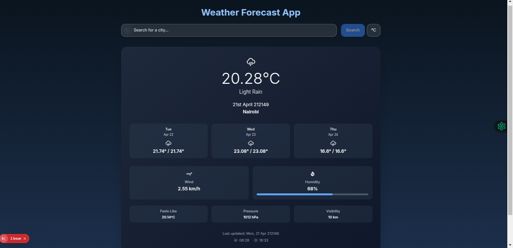

# Go Weather App

A full-stack weather forecast application built using a decoupled architecture.

[Wireframe Reference (Page 2)](https://docs.google.com/document/d/1b2c0PGxCRV34K06jz_D_OGpPKPR7CrVByB8OYmL33xY/edit?tab=t.0)

---

## Screenshots



## Prerequisites

Before you begin, ensure you have the following installed:

- **Go 1.21+**: [Download Go](https://go.dev/doc/install)
- **Air** (for live reload in Go): [Install Air](https://github.com/cosmtrek/air)
- **Node.js 18+**: [Download Node.js](https://nodejs.org/en)
- **Yarn** (preferred): `npm install --global yarn`

---

## Setting Up the Project

### 1. Clone the Repository

```bash
git clone git@github.com:spookeyy/Go-Weather-App.git
cd Go-Weather-App
```

---

### ⚙️ Backend Setup (Go + Gin)

2. Navigate to the backend folder:

```bash
cd backend
```

3. Run the server using Air:

```bash
air
```

> Ensure `main.go` is located at: `backend/cmd/server/main.go`

---

### 💻 Frontend Setup (Next.js + TypeScript)

4. Navigate to the frontend folder:

```bash
cd ../frontend
```

5. Install dependencies:

```bash
yarn install
```

6. Start the development server:

```bash
yarn dev
```

---

## 🧪 Tech Stack

| Layer      | Tech Used                                               |
|------------|---------------------------------------------------------|
| Frontend   | Next.js, React, TypeScript, Tailwind CSS, Framer Motion |
| Backend    | Golang, Gin Framework                                   |
| API        | OpenWeatherMap API                                      |
| Dev Tools  | Air (Go hot reload)                                     |